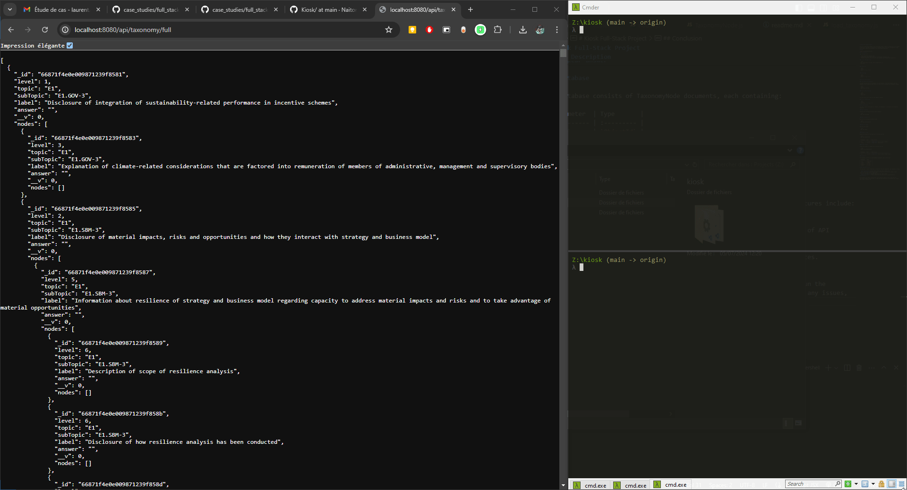

# Kiosk Full-Stack Project

This is a full-stack project for a job application, where the objective is to create an API and a web app to reconstruct a taxonomy from a CSV file, displaying a tree list view of topics and subtopics with associated questions.

- **API:** Node.js, Express, Mongoose (MongoDB)
- **Web App:** React, React-Router, MUI

## Demo



## Installation

### Prerequisites

- [Node.js](https://nodejs.org/)
- [npm](https://www.npmjs.com/) or [Yarn](https://yarnpkg.com/)
- [MongoDB Community Server](https://www.mongodb.com/try/download/community)

### Clone the Repository

```bash
  git clone https://github.com/Naitomea/Kiosk.git
  cd Kiosk
```

### Setup API

```bash
  cd api
  yarn # or npm install
```

### Setup App

```bash
  cd app
  yarn # or npm install
```
    
## Running the Project

### Load Data into Database

To load the data from the taxonomy.csv file located in the data folder into the database (this should be done only the first time or whenever the taxonomy changes):

```bash
  cd api
  node load_taxonomy
```

### Start the API Server

```bash
  cd api
  node index
```

The API server will start on port 8080 by default.

### Start the Web App

```bash
  cd app
  yarn start  # or npm start
```
## API Description

The API is built using Node.js, Express, and Mongoose. It provides the following endpoints:

#### Get Taxonomy

Retrieve the taxonomy sorted by topic/subtopic.

```bash
  GET /api/taxonomy/
```

#### Get Taxonomy Full

Retrieve the taxonomy sorted by level.

```bash
  GET /api/taxonomy/full
```

#### Get all nodes

Retrieve all nodes.

```bash
  GET /api/nodes
```

#### Update answer

Update the answer of the node with the specified ID.

```bash
  PUT /api/nodes/${id}
```

| Parameter | Type     | Description                       |
| :-------- | :------- | :-------------------------------- |
| `id`      | `string` | **Required**. Id of item to update |
| `answer`  | `string` | **Required**. New answer |

#### Clear answer

Clear the answer of thenode with the specified ID.

```bash
  DELETE /api/nodes/${id}
```

| Parameter | Type     | Description                       |
| :-------- | :------- | :-------------------------------- |
| `id`      | `string` | **Required**. Id of item to clear answer |

### Database

The database consists of TaxonomyNode documents, each containing:

| Parameter  | Type       | 
| :--------- | :--------- | 
| `_id`      | `ObjectId` |
| `level`    | `Number`   |
| `topic`    | `String`   |
| `subTopic` | `String`   |
| `answer`   | `String`   |

## Web App Description

The web app is built using React and MUI for the UI components. Key features include:

- **User Experience:** Prioritizes smooth and fluid interaction.
- **Data Fetching:** Fetches all data at startup to minimize the number of API calls, as the data size is negligible.
- **Dark/Light Mode:** Supports both dark and light themes.
- **Responsive Design:** Fully responsive and optimized for mobile devices.
## Conclusion

By following the above instructions, you should be able to set up and run the full-stack project successfully. If you have any questions or encounter any issues, feel free to contact me.